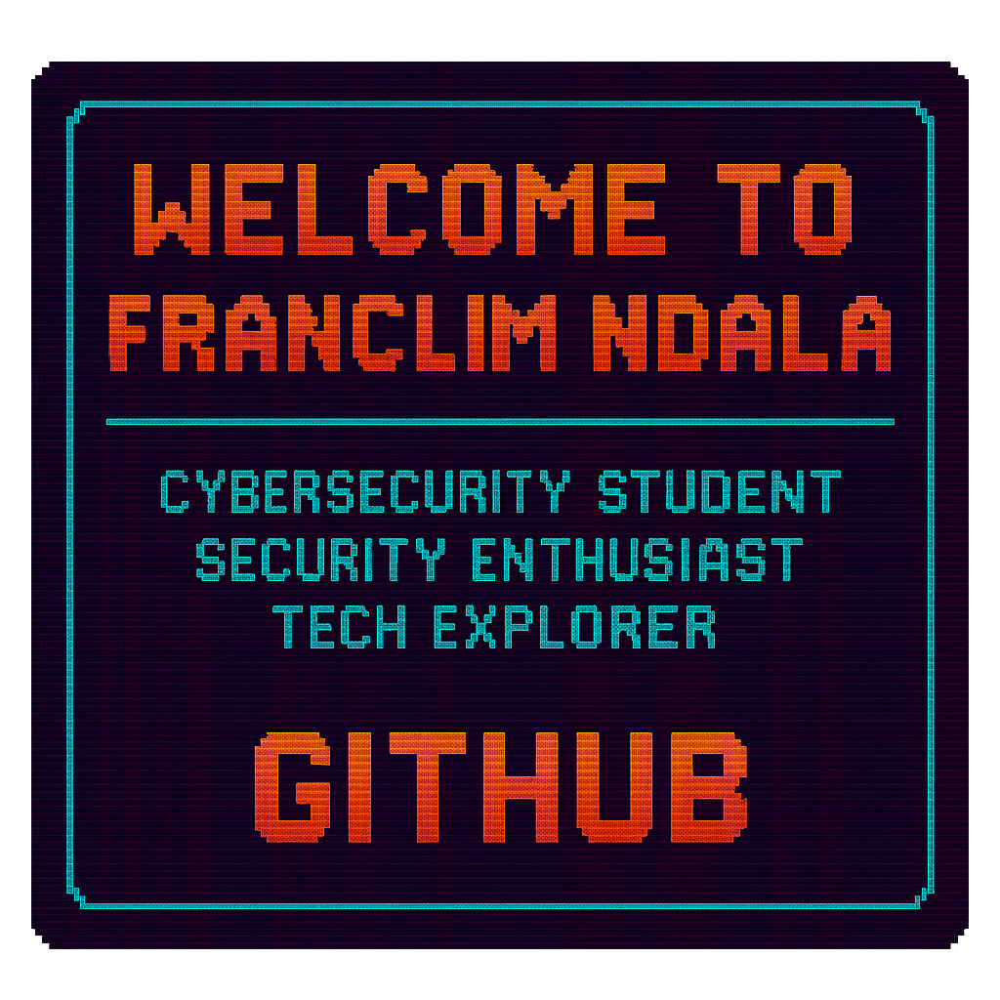

  

# 👋🏽 Hey, I'm Franclim Ndala / Olá, eu sou o Franclim Ndala

### 🧠 Cybersecurity Student | Security Enthusiast | Tech Explorer  
### 🧠 Estudante de Cibersegurança | Entusiasta de Segurança | Explorador de Tecnologia

🎓 I'm a Cybersecurity student at Leeds Beckett University, passionate about digital forensics, ethical hacking, and web security. I enjoy solving technical challenges, building skills with tools like Kali Linux, Autopsy, and Wireshark, and sharing my learning journey through GitHub.  
🇵🇹 Também sou fluente em português e sempre pronto para aprender mais — tanto em tech quanto na vida!

---

### 🚧 Currently Learning / Atualmente Estudando

- 🔐 Digital Forensics & Incident Response
- 🛡️ Ethical Hacking & Pen Testing (TryHackMe | Hack The Box)
- 🧠 CyBOK Knowledge Areas: Forensics, Malware Analysis, Risk Management
- ⚙️ Tools: Kali Linux, FTK, EnCase, Autopsy, Git
- 💻 Programming: Python basics, JavaScript for front-end
- 🌐 OWASP Top 10 & Web App Security

---

### 🛠 Tech Stack & Interests

- **Languages**: Python (learning), JavaScript, HTML, CSS  
- **Security Topics**: Cyber Forensics, Pen Testing, Network Security, SIEM, GDPR  
- **Tools**: Git & GitHub, Wireshark, Oracle SQL Developer, FTK Imager, VirtualBox  
- **Others**: Computer hardware, building PCs, forensic casework simulations  

---

### 🧪 Projects & Repos

- 🧾 **[CyBOK PDP](#)** – My Personal Development Plan aligned with CyBOK areas  
- 🧠 **[TryHackMe Labs](#)** – Practice challenges and walkthroughs  
- 🧰 **[Forensics Practice](#)** – Learning projects with Autopsy & file system analysis  
- 💻 **[Simple Web Projects](#)** – Frontend projects to build up my dev muscle  

> 📌 Check out my pinned repos to follow my journey — from student to cybersecurity pro.

---

### 📈 GitHub Stats

---

### 🌍 Let’s Connect / Vamos nos Conectar

- 💼 [LinkedIn](https://www.linkedin.com/in/franclimndala/)
- 🖥️ [GitHub](https://github.com/Franclimmm)
- 📧 Email: franclimndala@gmail.com

---

_“Every expert was once a beginner.”_  
_"Todo especialista já foi um iniciante."_
